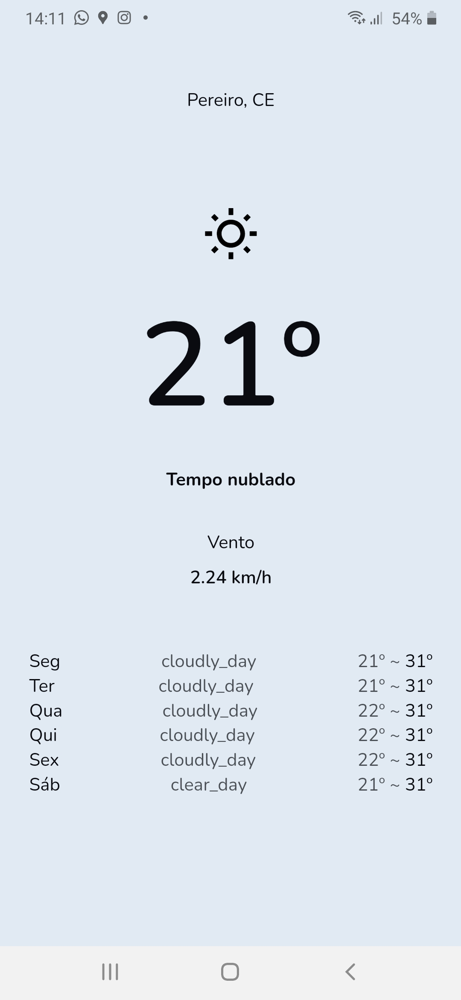

# Mini-Weather 🌤️

## A simple React Weather App to show how my city is :cloud:

### Screens

#### Light and Dark :smile:

* 🌞 Light in daytime
* 🌛 Dark during the night

#### Features
* Get user geolocation 
___

